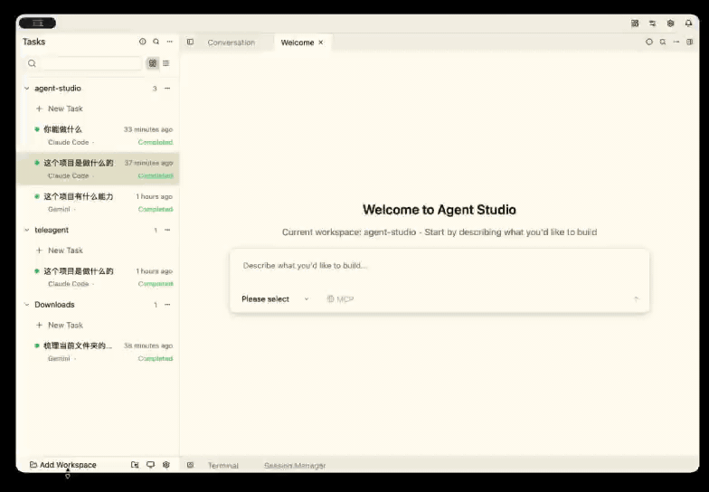
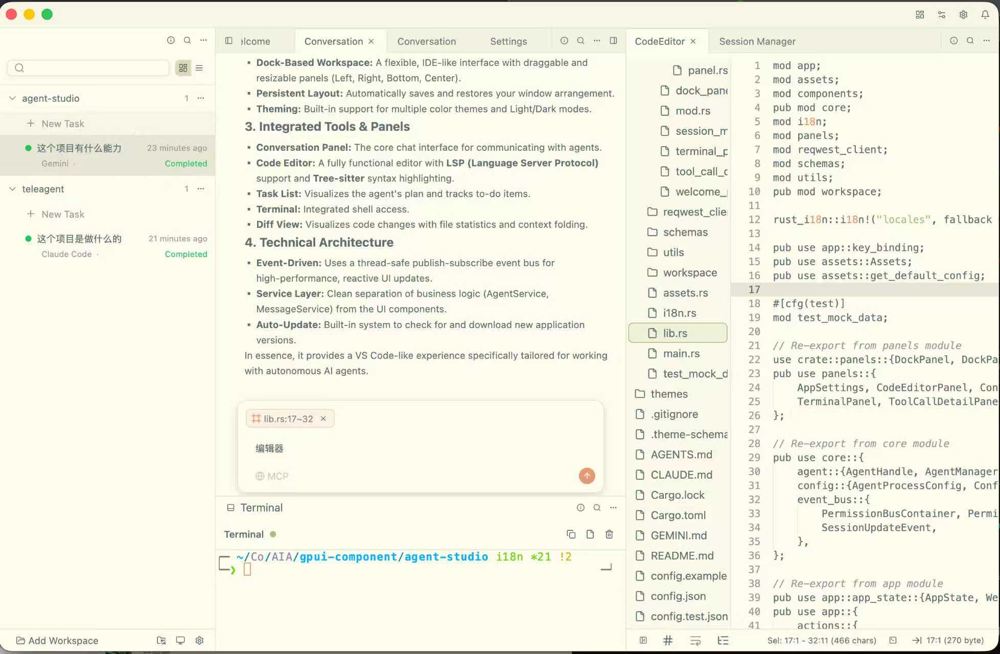
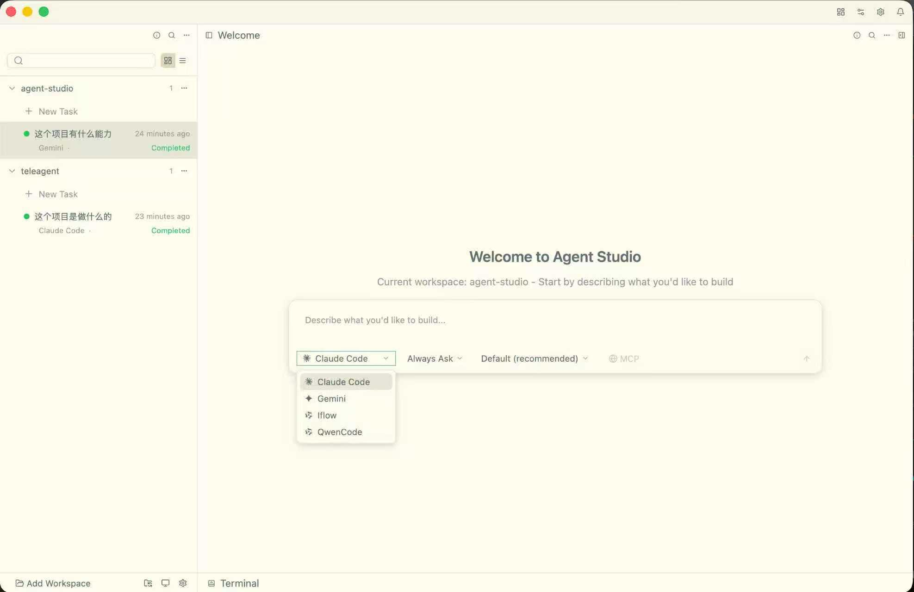
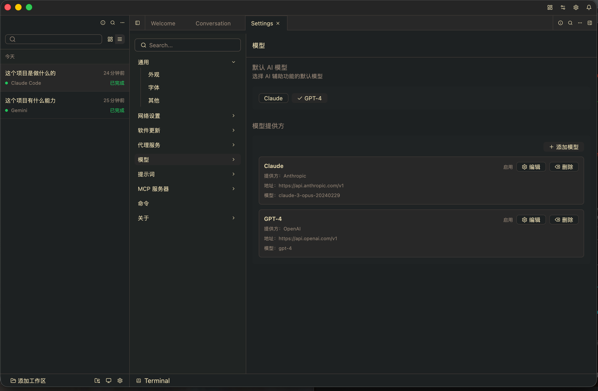

<div align="center">

# 🚀 AgentX

**现代化的桌面 AI 代理工作室**

[English](./README.md)

[](LICENSE)
[](#-安装)
[](https://github.com/sxhxliang/agent-studio/releases)
[](https://github.com/sxhxliang/agent-studio/releases)

[🎯 特性](#-特性) • [📦 安装](#-安装) • [🎬 演示](#-演示) • [🛠️ 开发](#%EF%B8%8F-开发) • [📖 文档](#-文档) • [❓ QA](#-qa)

</div>

---

## 🎬 演示

<div align="center">
  
</div>

<div align="center">
  
  
  
</div>

---

## ✨ 为什么选择 AgentX？

AgentX 是一个 **GPU 加速**、**跨平台**的桌面应用程序，将 AI 代理带入您的工作流程。采用尖端技术构建，它为与多个 AI 代理交互、编辑代码、管理任务等提供了无缝体验——一切都在一个统一的界面中。

### 🎯 特性

- 🤖 **多代理支持** - 通过代理客户端协议 (ACP) 同时连接和与多个 AI 代理聊天
- 💬 **实时对话** - 流式响应，支持思考块和工具调用
- 📝 **内置代码编辑器** - 支持 LSP 的编辑器，具有语法高亮和自动完成
- 🖥️ **集成终端** - 无需离开应用即可执行命令
- 🎨 **可定制的停靠系统** - 拖放面板以创建您的完美工作空间
- 🌍 **国际化** - 支持多种语言（English、简体中文）
- 🎭 **主题支持** - 浅色和深色主题，可自定义颜色
- 📊 **会话管理** - 跨多个会话组织对话
- 🔧 **工具调用查看器** - 详细检查代理工具执行
- 💾 **自动保存** - 通过自动会话持久化永不丢失工作
- ⚡ **GPU 加速** - 由 GPUI 框架提供的超快 UI

---

## 🤖 支持的 Agent

基于本仓库的 `config.json`, 目前我们已经测试的Agent 列表：

<div align="center">
  <table>
    <tr>
      <td align="center">
        
        <br />Codex
      </td>
      <td align="center">
        
        <br />Claude
      </td>
      <td align="center">
        
        <br />Kimi Code
      </td>
    </tr>
    <tr>
      <td align="center">
        
        <br />Qwen
      </td>
      <td align="center">
        
        <br />Qoder
      </td>
      <td align="center">
        
        <br />OpenCode
      </td>
    </tr>
    <tr>
      <td align="center">
        
        <br />Gemini
      </td>
      <td align="center">
        
        <br />AugmentCode
      </td>
      <td align="center">
        
        <br />Iflow
      </td>
    </tr>
  </table>
</div>

### 更多 ACP 兼容的 Agent

来自 ACP ["Agents implementing the Agent Client Protocol"](https://agentclientprotocol.com/get-started/agents) 列表：

- AgentPool
- Blackbox AI
- Code Assistant
- Docker 的 cagent
- fast-agent
- GitHub Copilot（公测）
- Goose
- JetBrains Junie（即将推出）
- Minion Code
- Mistral Vibe
- OpenHands
- Pi（通过 pi-acp 适配器）
- Stakpak
- VT Code

---

## 📦 安装

### 📥 [下载最新版本](https://github.com/sxhxliang/agent-studio/releases)

<details>
<summary><b>查看各平台详细安装说明</b></summary>

### 下载预构建二进制文件

获取适用于您平台的最新版本：

#### 🪟 Windows

下载文件：`agentx-v{version}-x86_64-windows.zip` 或 `agentx-{version}-setup.exe`

```bash
# 解压并运行
# 或双击 setup.exe 安装

# 使用 winget（即将推出）
# winget install AgentX
```

#### 🐧 Linux

下载文件：`agentx-v{version}-x86_64-linux.tar.gz` 或 `agentx_{version}_amd64.deb`

```bash
# 对于 Debian/Ubuntu (.deb)
sudo dpkg -i agentx_0.5.0_amd64.deb

# 对于其他发行版 (.tar.gz)
tar -xzf agentx-v0.5.0-x86_64-linux.tar.gz
cd agentx
./agentx

# 或使用 AppImage
chmod +x agentx-v0.5.0-x86_64.AppImage
./agentx-v0.5.0-x86_64.AppImage
```

#### 🍎 macOS

下载文件：`agentx-v{version}-aarch64-macos.dmg` (Apple Silicon) 或 `agentx-v{version}-x86_64-macos.dmg` (Intel)

```bash
# 双击 .dmg 文件并将 AgentX 拖到应用程序文件夹

# 使用 Homebrew（即将推出）
# brew install --cask agentx
```

</details>

---

## 🚀 快速开始

1. **下载** 适用于您平台的 AgentX，从 [发布页面](https://github.com/sxhxliang/agent-studio/releases)
2. **安装** 遵循上述针对您操作系统的说明
3. **启动** AgentX
4. **配置** 您的 AI 代理，在设置 → MCP 配置
5. **开始聊天**！

---

## 🛠️ 开发

<details>
<summary><b>点击展开开发指南</b></summary>

### 前提条件

- Rust 1.83+（2024 版本）
- 平台特定的依赖项：
  - **Windows**：MSVC 工具链
  - **Linux**：`libxcb`、`libfontconfig`、`libssl-dev`
  - **macOS**：Xcode 命令行工具

### 从源代码构建

```bash
# 克隆仓库
git clone https://github.com/sxhxliang/agent-studio.git
cd agent-studio

# 构建并运行
cargo run

# 发布构建
cargo build --release
```

### 开发命令

```bash
# 带日志运行
RUST_LOG=info cargo run

# 运行测试
cargo test

# 检查代码
cargo clippy

# 格式化代码
cargo fmt
```

</details>

---

## 🏗️ 构建技术

- **[GPUI](https://www.gpui.rs/)** - 来自 Zed Industries 的 GPU 加速 UI 框架
- **[gpui-component](https://github.com/longbridge/gpui-component)** - 丰富的 UI 组件库
- **[代理客户端协议](https://crates.io/crates/agent-client-protocol)** - 代理通信的标准协议
- **[Tokio](https://tokio.rs/)** - 异步运行时
- **[Tree-sitter](https://tree-sitter.github.io/)** - 语法高亮
- **Rust** - 内存安全的系统编程语言

---

## 📖 文档

- [用户指南](docs/user-guide.zh-CN.md) - 学习如何使用 AgentX
- [架构](CLAUDE.md) - 技术架构和设计
- [贡献指南](CONTRIBUTING.zh-CN.md) - 如何为项目做出贡献
- [代理配置](docs/agent-config.zh-CN.md) - 设置您的 AI 代理

---

## ❓ QA

### Q: 如果 agent 列表中没有任何 agent，怎么办？

A: 这通常是网络环境导致的。请先设置代理，并在启动页或设置面板中完成代理配置后再重试。

### Q: 应用是否负责 agent 的授权和可用性管理？

A: 不负责。AgentX 仅提供桌面工作台能力，不管理各 agent 的授权状态或服务可用性。使用前请先确保目标 agent 已完成授权且可正常使用。

### Q: AgentX 能启动，但 Agent 没有响应，先检查什么？

A: 打开 `设置 -> MCP 配置`，检查 `config.json` 中的提供商配置（API 地址、密钥、命令路径、环境变量）是否正确。

### Q: 停靠布局错乱了，如何重置？

A: 关闭 AgentX，删除 `docks-agentx.json`，然后重新启动应用。

### Q: 运行时和会话数据保存在哪里？

A: 调试构建时布局/会话运行时文件会写入 `agentx/`，会话数据保存在 `sessions/`。

### Q: 遇到启动或集成问题，如何排查？

A: 启用日志运行：

```bash
RUST_LOG=info cargo run
```

---

## 🤝 贡献

我们欢迎贡献！无论是错误报告、功能请求还是拉取请求——每一份贡献都有助于使 AgentX 变得更好。

1. Fork 仓库
2. 创建您的功能分支（`git checkout -b feature/amazing-feature`）
3. 提交您的更改（`git commit -m 'Add amazing feature'`）
4. 推送到分支（`git push origin feature/amazing-feature`）
5. 打开拉取请求

---

## 🌟 表达您的支持

如果您觉得 AgentX 有帮助，请考虑：

- ⭐ **给这个仓库加星**以表达您的支持
- 🐦 **分享**给您的朋友和同事
- 🐛 **报告错误**以帮助我们改进
- 💡 **建议功能**您希望看到的

<div align="center">
  
  <br />
  <span>关注微信公众号，获取最新动态</span>
</div>

---

## 📝 许可证

本项目根据 **Apache-2.0 许可证**授权。有关详细信息，请参阅 [LICENSE](LICENSE) 文件。

---

## 🙏 致谢

特别感谢：

- **[Zed Industries](https://zed.dev/)** 提供的出色 GPUI 框架
- **[GPUI Component](https://github.com/longbridge/gpui-component)** 贡献者
- 所有我们的**贡献者**和**支持者**

---
## Star History

<p align="center">
  <a href="https://star-history.dera.page/#sxhxliang/agent-studio&Date">
    <picture>
      <source media="(prefers-color-scheme: dark)" srcset="https://star-history.dera.page/svg?repos=sxhxliang/agent-studio&type=Date&theme=dark"/>
      
    </picture>
  </a>
</p>

<div align="center">

**使用 ❤️ 和 [GPUI](https://www.gpui.rs/) 构建**

[⬆ 返回顶部](#-agentx)

</div>
